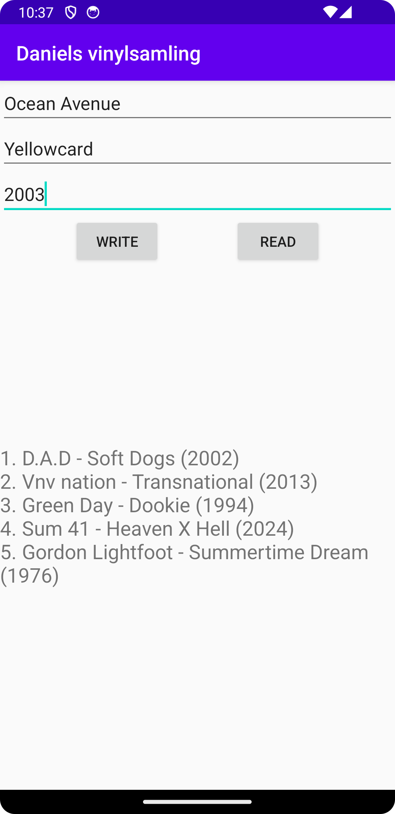
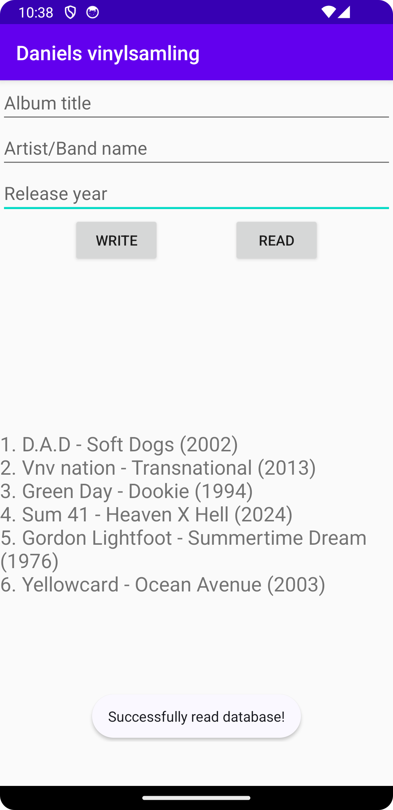

# Rapport

En layout skapades med tre olika EditText som var och en ansvarar för inmatning av data i tre olika kolumner
i databasen. Två knappar "Read" och "Write" läggs till, "Write" ska ansvara för att skriva de inmatade fälten
till databasen och "Read" ansvarar för att läsa in databasen och skriva ut innehållet i databastabellerna 
i en lista i en TextView.

```
private EditText titleInput, artistInput, yearInput;
private TextView listRecords;
private Button readButton, writeButton;

titleInput = findViewById(R.id.titleField);
artistInput = findViewById(R.id.artistField);
yearInput = findViewById(R.id.yearField);
readButton = findViewById(R.id.readButton);
writeButton = findViewById(R.id.writeButton);
```

För att skapa och hantera SQLLite databas så skapas två klasser. En klass som extendar SQLiteOpenHelper
och som skapar och hanterar databasen (DatabaseHelper) och en klass som specar upp hur databasens tabeller 
ska se ut (DatabaseTables).

För att lägga till data i databasen så lagras det som skrivs in i varje EditText till variabler där
används också trim() för att ta bort whitespace i början och slutet av det som skrivs in. Detta för att 
underlätta en kontroll så att fälten inte är tomma eller innehåller endast mellanslag.

```
String title = titleInput.getText().toString().trim();
String artist = artistInput.getText().toString().trim();
String yearString = yearInput.getText().toString().trim();
```

 
